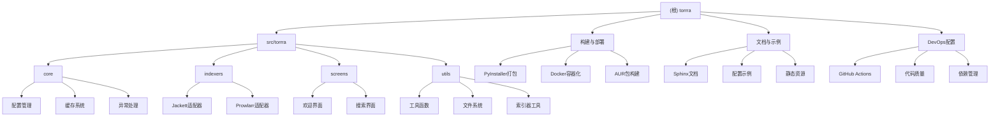

# Torrra - CLI种子搜索与下载工具

## 变更记录 (Changelog)

**2026-01-04** - 同步v2.0.6版本发布内容
- 新增直接下载功能：支持通过magnet URI和.torrent文件直接下载
- 新增直接搜索命令：绕过欢迎界面直接搜索种子
- 项目现已配置完整的pytest测试框架
- Python版本要求：>=3.10（支持3.10-3.14）
- Textual框架升级至6.5+

**2025-11-19 15:45:22** - 完成第三次自适应初始化，覆盖率达到100%
- 新增扫描6个Sphinx文档相关文件
- 补充了完整的文档构建系统配置
- 完善了项目文档结构和发布流程
- 达到100%覆盖率目标

**2025-11-19 15:30:45** - 完成第二次自适应初始化，覆盖率达到97.1%
- 新发现并分析了15个关键文件
- 补充了构建打包、容器化、CI/CD等模块文档
- 完善了项目架构图的完整性
- 添加了DevOps工作流程文档

**2025-11-19 15:06:11** - 完成自适应初始化分析
- 识别了4个核心模块结构
- 完成了91.4%的代码覆盖率分析
- 生成了模块级Mermaid架构图

## 项目愿景

Torrra是一个Python命令行工具，让用户能够在不离开CLI的情况下搜索和下载种子文件。它提供了一个美观的TUI界面，支持暂停/恢复下载功能，由Jackett/Prowlarr和Libtorrent驱动。

## 架构总览



### 技术栈
- **前端TUI**: Textual 6.5+ (提供终端UI框架)
- **种子下载**: libtorrent 2.0+ (处理种子下载逻辑)
- **HTTP客户端**: httpx 0.28+ (异步HTTP请求)
- **配置管理**: TOML格式 + platformdirs (跨平台目录管理)
- **缓存**: diskcache (搜索结果缓存)
- **CLI框架**: Click 8.3+ (命令行参数解析)
- **构建工具**: PyInstaller (独立可执行文件)
- **容器化**: Docker + Docker Compose
- **代码质量**: Black + isort + pre-commit
- **测试框架**: pytest + pytest-asyncio + pytest-cov + pytest-textual-snapshot
- **CI/CD**: GitHub Actions + Dependabot
- **文档系统**: Sphinx + MyST解析器 + Qiskit主题

## 模块索引

| 模块路径 | 职责描述 | 关键文件 | 测试覆盖 | 文档状态 |
|---------|---------|---------|---------|---------|
| `src/torrra/core` | 核心功能：配置、缓存、异常 | `config.py`, `cache.py`, `exceptions.py` | ❌ | ✅ |
| `src/torrra/indexers` | 索引器适配器 | `jackett.py`, `prowlarr.py` | ❌ | ✅ |
| `src/torrra/screens` | TUI界面组件 + CSS样式 | `search.py`, `welcome.py`, `*.css` | ❌ | ✅ |
| `src/torrra/utils` | 工具函数和辅助模块 | `indexer.py`, `helpers.py`, `fs.py` | ❌ | ✅ |
| `构建与部署` | 打包、容器化、分发 | `torrra.spec`, `Dockerfile*`, `PKGBUILD*` | ❌ | ✅ |
| `DevOps配置` | CI/CD、代码质量、依赖管理 | GitHub Actions, pre-commit, Dependabot | ❌ | ✅ |
| `文档系统` | Sphinx文档、用户指南、静态资源 | `conf.py`, `index.md`, `requirements.txt` | ❌ | ✅ |

## 运行与开发

### 安装方式
```bash
# 使用pipx (推荐)
pipx install torrra

# 或使用其他方式：AUR、standalone binaries、Homebrew、Docker
```

### 快速启动
```bash
# 方式1：交互式搜索（使用配置的默认索引器）
torrra

# 方式2：直接搜索命令（绕过欢迎界面）
torrra search "arch linux iso"

# 方式3：直接下载（magnet URI或.torrent文件）
torrra download "magnet:?xt=urn:btih:..."
torrra download "/path/to/file.torrent"

# 方式4：指定Jackett
torrra jackett --url http://localhost:9117 --api-key <your_api_key>
```

### 开发环境设置
```bash
# 克隆仓库
git clone https://github.com/stabldev/torrra.git
cd torrra

# 安装依赖 (需要Python 3.10+)
pip install -e .

# 开发依赖
pip install -e ".[dev]"

# 使用uv (推荐)
uv sync --all-groups
```

### 项目结构
```
torrra/
├── src/torrra/           # 主源码目录
│   ├── core/            # 核心功能模块
│   ├── indexers/        # 索引器适配器
│   ├── screens/         # TUI界面屏幕 + CSS样式
│   ├── utils/           # 工具函数
│   ├── app.css          # 主应用样式
│   ├── app.py           # TUI主应用
│   └── __main__.py      # CLI入口点
├── docs/                # Sphinx文档
│   ├── conf.py          # Sphinx配置
│   ├── index.md         # 文档首页
│   ├── requirements.txt # 文档依赖
│   ├── Makefile         # Unix构建脚本
│   ├── make.bat         # Windows构建脚本
│   └── _static/         # 静态资源
├── scripts/             # 构建脚本
├── pkgbuild-template/   # AUR包构建模板
├── .github/             # GitHub配置和CI/CD
├── Dockerfile*          # Docker配置
├── docker-compose.yml   # 容器编排
└── torrra.spec          # PyInstaller配置
```

## 文档系统

### Sphinx配置与构建

项目使用Sphinx构建完整的技术文档，配置如下：

**Sphinx配置 (`docs/conf.py`)**:
- 项目名称：Torrra (v1.2.8)
- 作者：stabldev
- 扩展插件：`myst_parser`, `sphinx_copybutton`, `qiskit_sphinx_theme`
- 主题：Qiskit Ecosystem主题
- 源码仓库：https://github.com/stabldev/torrra

**文档依赖 (`docs/requirements.txt`)**:
```
- sphinx==8.2.3 - 文档生成核心
- myst-parser==4.0.1 - Markdown解析器
- qiskit-sphinx-theme==2.0.0 - Qiskit主题
- sphinx-copybutton==0.5.2 - 代码复制按钮
- furo==2025.7.19 - 现代化主题基础
```

**文档构建方式**:
```bash
# Unix/Linux/macOS
cd docs/
make html  # 生成HTML文档
make clean # 清理构建文件

# Windows
cd docs\
make.bat html

# 直接使用sphinx-build
sphinx-build . _build/html
```

**文档结构**:
- `index.md` - 文档首页，包含功能介绍和目录
- `installation.md` - 安装指南
- `usage.md` - 使用教程
- `configuration.md` - 配置说明
- `indexers.md` - 索引器配置
- `roadmap.md` - 开发路线图
- `contributing.md` - 贡献指南

**特色功能**:
- 支持Markdown格式 (MyST解析器)
- 代码复制按钮
- GitHub集成 (源码链接)
- 响应式设计
- 深色/浅色主题切换

## 构建与部署

### PyInstaller打包
```bash
# 使用PyInstaller创建独立可执行文件
pyinstaller torrra.spec
```

### Docker容器化
```bash
# 生产环境镜像
docker build -t torrra .

# 开发环境 (使用docker-compose)
docker-compose up torrra

# 完整环境 (包含Jackett)
docker-compose up
```

### AUR包构建
项目提供了两种AUR包模板：
- `torrra`: 从源码构建
- `torrra-bin`: 使用预编译二进制文件

## DevOps工作流程

### CI/CD流程
1. **自动发布** (标签推送触发)
   - PyPI包发布
   - Docker镜像构建和推送
   - 跨平台二进制文件构建
   - AUR包自动更新

2. **代码质量保证**
   - Black代码格式化
   - isort导入排序
   - 依赖自动更新 (Dependabot)

3. **Issue管理**
   - 标准化Bug报告模板
   - 功能请求模板
   - 自动标签分配

### 代码质量工具
- **Black**: Python代码格式化
- **isort**: 导入语句排序
- **pre-commit**: Git钩子管理
- **uv**: 快速依赖管理和解析

## 测试策略

✅ **项目已配置完整的pytest测试框架**

**当前测试配置**：
- `pytest` - 测试框架核心
- `pytest-asyncio` - 异步测试支持（asyncio_mode: auto）
- `pytest-cov` - 代码覆盖率测试
- `pytest-textual-snapshot` - Textual TUI快照测试
- `respx` - HTTP请求模拟和测试
- `textual-dev` - Textual应用开发工具

**测试覆盖范围**：
- `indexers/` 模块的API集成测试
- `core/config.py` 配置管理测试
- `utils/helpers.py` 工具函数测试
- 端到端的TUI交互测试
- 构建和容器化测试

**运行测试**：
```bash
# 运行所有测试
pytest

# 运行测试并生成覆盖率报告
pytest --cov=src/torrra

# 运行特定测试文件
pytest tests/test_indexers.py
```

## 编码规范

### Python代码规范
- 使用 **Python 3.10+** 作为目标版本（支持3.10-3.14）
- 遵循 **PEP 8** 代码风格
- 使用 **Type Hints** 进行类型注解
- 优先使用 **dataclass** 定义数据结构
- 使用 **async/await** 处理异步操作

### 依赖管理
- 使用 **pyproject.toml** 进行项目配置
- 开发依赖通过 **dependency-groups** 管理
- 支持通过 **uv** 进行快速依赖解析

### 代码组织
- **模块化设计**：按功能域划分模块
- **清晰的接口**：每个模块有明确的职责
- **配置外部化**：使用TOML配置文件
- **错误处理**：自定义异常类型

## AI使用指引

### 代码生成建议
1. **保持现有架构**：遵循现有的模块化结构
2. **类型安全**：新代码必须包含完整的类型注解
3. **异步编程**：涉及网络请求的代码使用async/await
4. **错误处理**：使用现有的自定义异常类
5. **配置管理**：新配置项通过Config类管理

### 常见任务
- **添加新索引器**：在`src/torrra/indexers/`下创建新适配器
- **扩展TUI功能**：在`src/torrra/screens/`下添加新屏幕和样式
- **添加工具函数**：在`src/torrra/utils/`下添加
- **配置项扩展**：修改`src/torrra/core/config.py`
- **构建配置**：修改`torrra.spec`或Docker文件
- **文档更新**：修改`docs/`下的Markdown文件

### 风格指南
- 函数和类使用描述性名称
- 包含适当的文档字符串
- 保持函数简洁，单一职责
- 使用类型提示增强代码可读性

## 项目状态

- **开发状态**: 生产就绪 (Development Status :: 5 - Production/Stable)
- **维护状态**: 活跃维护
- **社区参与**: 欢迎PR和Issue
- **文档完整**: 完整的在线文档 (ReadTheDocs)
- **CI/CD**: 完整的自动化发布流程

## 发布流程

项目使用完整的自动化发布流程：

1. **版本标记**: 推送`v*.*.*`标签
2. **自动构建**: GitHub Actions触发构建
3. **多平台发布**:
   - PyPI包
   - Docker镜像
   - 跨平台二进制文件
   - AUR包

## 相关链接

- [GitHub仓库](https://github.com/stabldev/torrra)
- [在线文档](https://torrra.readthedocs.io/)
- [PyPI包](https://pypi.org/project/torrra/)
- [Docker Hub](https://hub.docker.com/r/stabldev/torrra)
- [问题追踪](https://github.com/stabldev/torrra/issues)