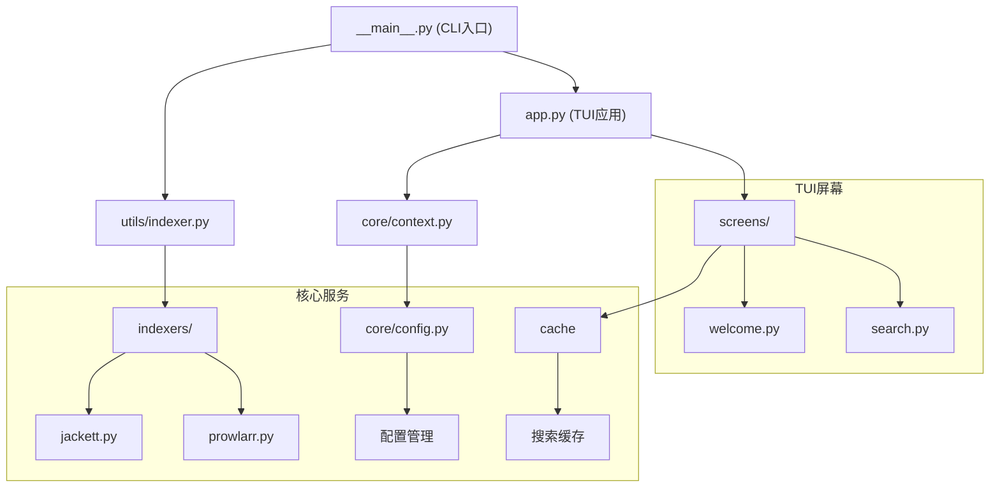

[根目录](../../CLAUDE.md) > **src/torrra**

# Torrra 主模块

## 变更记录 (Changelog)

**2025-11-19 15:06:11** - 完成主模块文档初始化
- 分析了22个核心文件
- 识别了4个主要子模块
- 建立了模块依赖关系图

## 模块职责

Torrra主模块是整个应用程序的核心，提供命令行界面和TUI（终端用户界面）功能，支持通过Jackett或Prowlarr搜索种子，并使用libtorrent进行下载。

## 模块架构



## 入口与启动

### 主入口点
- **文件**: `__main__.py`
- **CLI命令**: `torrra`
- **入口函数**: `cli()` 函数

### 启动流程
1. **CLI解析** (`__main__.py:cli()`)
   - 处理全局选项（`--no-cache`）
   - 自动检测索引器或执行子命令

2. **索引器验证** (`utils/indexer.py:handle_indexer_command()`)
   - 验证Jackett/Prowlarr连接
   - 加载/保存配置

3. **TUI启动** (`app.py:TorrraApp`)
   - 初始化Textual应用
   - 显示欢迎屏幕
   - 进入搜索界面

### 支持的命令
```bash
torrra                    # 自动检测默认索引器
torrra jackett [options]  # 使用Jackett
torrra prowlarr [options] # 使用Prowlarr
torrra config get <key>   # 获取配置
torrra config set <key> <value> # 设置配置
torrra config list        # 列出所有配置
```

## 对外接口

### CLI接口
- **主命令组**: `@click.group()`
- **全局选项**: `--no-cache`, `--version`
- **子命令**: `jackett`, `prowlarr`, `config`

### TUI接口
- **主应用类**: `TorrraApp`
- **键盘绑定**:
  - `q`: 退出应用
  - `d`: 切换暗黑模式
  - `esc`: 清除焦点
  - `s`: 聚焦搜索框
  - `p`: 暂停下载
  - `r`: 恢复下载

### 数据类型接口
```python
# 种子数据结构
@dataclass
class Torrent:
    title: str
    size: float
    seeders: int
    leechers: int
    source: str
    magnet_uri: str | None

# 索引器配置
@dataclass
class Indexer:
    name: IndexerName  # "jackett" | "prowlarr"
    url: str
    api_key: str
```

## 关键依赖与配置

### 核心依赖
- **textual** (>=4.0.0): TUI框架
- **click** (>=8.2.1): CLI框架
- **httpx** (>=0.28.1): HTTP客户端
- **libtorrent** (>=2.0.11): 种子下载引擎
- **diskcache** (>=5.6.3): 缓存系统
- **platformdirs** (>=4.3.8): 跨平台目录管理

### 配置文件
- **位置**: `~/.config/torrra/config.toml`
- **格式**: TOML
- **默认配置**:
  ```toml
  [general]
  download_path = "~/Downloads"
  remember_last_path = true

  [indexers.default]
  # 默认索引器名称
  ```

### 环境要求
- **Python版本**: >=3.13
- **操作系统**: Linux/macOS/Windows
- **外部依赖**: Jackett或Prowlarr服务器

## 子模块详解

### core/ - 核心功能
- **config.py**: 配置管理，支持TOML格式的用户配置
- **cache.py**: 基于diskcache的搜索结果缓存
- **exceptions.py**: 自定义异常类
- **context.py**: 共享配置实例
- **constants.py**: 常量定义（如缓存TTL）

### indexers/ - 索引器适配器
- **jackett.py**: Jackett API适配器
- **prowlarr.py**: Prowlarr API适配器
- 支持搜索结果标准化和连接验证

### screens/ - TUI界面
- **welcome.py**: 欢迎界面，显示应用横幅和版本信息
- **search.py**: 搜索界面，包含结果表格和下载进度
- 每个屏幕都有对应的CSS样式文件

### utils/ - 工具函数
- **indexer.py**: 索引器工具和自动检测逻辑
- **helpers.py**: 通用辅助函数（文件大小格式化等）
- **fs.py**: 文件系统工具（处理资源路径）

## 数据模型

### Torrent模型
```python
class Torrent:
    title: str        # 种子标题
    size: float       # 文件大小（字节）
    seeders: int      # 做种数
    leechers: int     # 下载数
    source: str       # 来源索引器
    magnet_uri: str | None  # 磁力链接
```

### 配置模型
- 支持嵌套配置结构
- 自动创建默认配置
- 类型安全的配置访问

## 工作流程

### 搜索流程
1. 用户输入搜索关键词
2. 调用索引器API（Jackett/Prowlarr）
3. 缓存搜索结果（可选）
4. 在TUI中显示结果表格
5. 用户选择种子进行下载

### 下载流程
1. 解析磁力链接或种子文件
2. 创建libtorrent会话
3. 开始下载并显示进度
4. 支持暂停/恢复操作
5. 完成后继续做种

## 常见问题 (FAQ)

### Q: 如何配置多个索引器？
A: 目前只支持配置一个默认索引器，但可以通过命令行参数临时切换。

### Q: 下载的文件保存在哪里？
A: 默认保存在系统下载目录，可通过配置文件自定义。

### Q: 支持哪些操作系统？
A: 支持Linux、macOS和Windows，使用跨平台的Python依赖。

### Q: 如何禁用缓存？
A: 使用`--no-cache`命令行选项或在配置中设置。

## 相关文件清单

### 核心文件
- `__main__.py` - CLI入口点
- `app.py` - TUI主应用
- `_types.py` - 数据类型定义
- `_version.py` - 版本管理

### 模块文件 (22个)
```
core/
├── __init__.py
├── cache.py
├── config.py
├── constants.py
├── context.py
└── exceptions.py

indexers/
├── __init__.py
├── jackett.py
└── prowlarr.py

screens/
├── __init__.py
├── search.py
├── search.css
├── welcome.py
└── welcome.css

utils/
├── __init__.py
├── fs.py
├── helpers.py
└── indexer.py
```

### 样式文件
- `app.css` - 主应用样式
- `screens/search.css` - 搜索界面样式
- `screens/welcome.css` - 欢迎界面样式

## 开发建议

### 扩展功能
1. **添加新索引器**: 在`indexers/`目录下创建新的适配器
2. **扩展TUI功能**: 在`screens/`下添加新界面
3. **增强配置选项**: 扩展`core/config.py`
4. **改进缓存策略**: 优化`core/cache.py`

### 代码质量
- 所有公共函数都需要类型注解
- 异步函数使用async/await
- 错误处理使用自定义异常类
- 遵循Textual应用的最佳实践